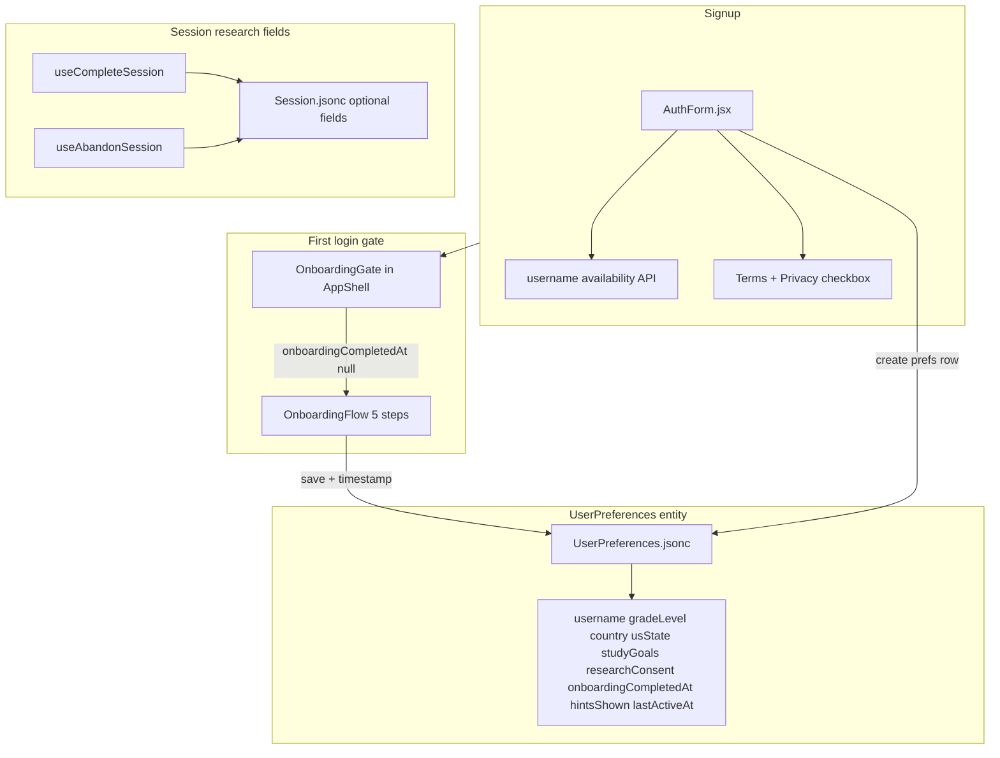
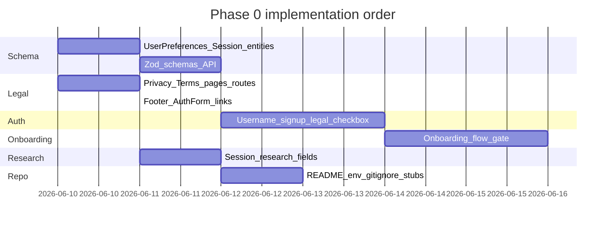

# Phase 0 — Detailed Implementation Plan

**Source of truth:** [`veridian_phase0_cursor_guide.md`](../veridian_phase0_cursor_guide.md)  
**Goal:** Legal compliance, signup + username, skippable onboarding with research consent, session research fields, README/repo hygiene — without touching study planner, FSRS, AI, or core data-fetch hooks.

**Out of scope (outdated — do not implement):** Firebase, Google OAuth, JourneyGridZone wiring.

**Exit criteria:** New user can sign up with username + legal consent → optional onboarding → land on `/home`; legal pages public; session records capture research fields; repo cleaned; README accurate.

---

## Hard constraints (from guide — do not violate)

| Do NOT change | Exception |
|---|---|
| `studyPlanner.js`, Due Today aggregation logic | — |
| FSRS (`src/utils/fsrs/`) | — |
| AI generation (`geminiStudy`, `geminiJourney`, study AI hooks) | — |
| Journey / Module / Activity / Card entity shapes | **Add** fields only |
| Existing Session field names/types | **Add** optional research fields only |
| Routing beyond `/privacy`, `/terms`, `/onboarding` (if used) | — |
| Components not listed in guide | — |

---

## Architecture overview



---

## Workstream 1 — Legal pages

### 1.1 Create pages

| File | Route |
|---|---|
| [`src/pages/legal/PrivacyPage.jsx`](../src/pages/legal/PrivacyPage.jsx) | `/privacy` |
| [`src/pages/legal/TermsPage.jsx`](../src/pages/legal/TermsPage.jsx) | `/terms` |

**Layout:** Use `MarketingLayout` (public, no auth) — same as landing/signin.

**Styling:** Reuse app dark theme; max-width content column (~720px); `h1`, `h2`, short paragraphs; `lastUpdated` at top (use fixed date e.g. June 2026).

**Privacy must include:**
- Data collected (cross-ref Workstream 3 field list + session behavioral fields)
- Use: power study system, improve product, **anonymized aggregate research**
- No sale of data; no behavioral ads
- Minimum age 13
- Deletion: contact email → account deleted within 30 days
- Retention: while account active; purge within 30 days of deletion request

**Terms must include:**
- Age 13+ confirmation via signup checkbox
- User owns uploaded content; Veridian owns platform
- AI content may contain errors; not official study material
- Right to terminate violating accounts
- No guarantee of educational outcomes

**Constants:** Add `src/lib/legal.js` with `LEGAL_CONTACT_EMAIL` (e.g. `support@veridian.study` or your research email), `LEGAL_LAST_UPDATED`.

### 1.2 Routing

Update [`src/App.jsx`](../src/App.jsx) — under `MarketingLayout`:

```jsx
<Route path="/privacy" element={<PrivacyPage />} />
<Route path="/terms" element={<TermsPage />} />
```

### 1.3 Links

| Location | Change |
|---|---|
| [`src/components/layout/AppFooter.jsx`](../src/components/layout/AppFooter.jsx) | Add Privacy + Terms links |
| [`src/components/auth/AuthForm.jsx`](../src/components/auth/AuthForm.jsx) | Legal checkbox + inline links (signup only) |
| [`src/pages/stubs/SettingsStubPage.jsx`](../src/pages/stubs/SettingsStubPage.jsx) | Footer-style links to Privacy/Terms (page is stub but routed) |

**Explicitly skip:** cookies banner, GDPR popup.

---

## Workstream 2 — User profile entity & schemas

### 2.1 Extend Base44 entity

File: [`base44/entities/UserPreferences.jsonc`](../base44/entities/UserPreferences.jsonc)

**Add properties** (all optional except note on username):

| Field | Type | Notes |
|---|---|---|
| `username` | string | Unique handle; replaces `displayName` as primary identity |
| `gradeLevel` | string | Enum string from onboarding Step 3 |
| `country` | string | From dropdown |
| `usState` | string | Only when country = US |
| `studyGoals` | array of strings | Multi-select chips |
| `researchConsent` | boolean | default false |
| `researchConsentAt` | number (timestamp) | Set only when consent true |
| `onboardingCompletedAt` | number | Set on skip or finish |
| `onboardingStep` | number | Last completed step index (for drop-off analytics) |
| `lastActiveAt` | number | Updated each login |
| `createdAt` | number | Set on first prefs create if missing |

**Keep** existing fields (`themeDark`, `hintsShown`, `notificationPref`, etc.). Do **not** remove `displayName` yet — migrate reads to prefer `username`, stop writing `displayName` on new signups.

### 2.2 Zod schema

Update [`src/utils/schemas/preferences.js`](../src/utils/schemas/preferences.js):

- Add all new fields with appropriate enums/validators
- Add `usernameSchema`: `/^[a-z][a-z0-9_.]{2,19}$/` (3–20 chars, starts with letter, lowercase only on store)
- Export `GRADE_LEVELS`, `STUDY_GOAL_OPTIONS`, `US_STATES`, `COUNTRIES` constants (countries list: use compact JSON or `src/lib/geo/countries.js`)

### 2.3 API layer

Update [`src/api/entities/preferences.js`](../src/api/entities/preferences.js):

| Function | Purpose |
|---|---|
| `checkUsernameAvailable(username)` | Filter `UserPreferences` where `username === normalized`; exclude current user |
| `createUserPreferencesOnSignup({ username, userEmail })` | Create row after register/verify |
| `completeOnboarding(patch)` | Merge onboarding fields + set `onboardingCompletedAt` |
| `touchLastActive()` | Set `lastActiveAt` on login |

**Username normalization:** lowercase trim before validate/store.

**Uniqueness:** Base44 may not enforce unique indexes — implement check-before-write in API; on collision return clear error.

### 2.4 Hooks (minimal — prefs only)

| File | Action |
|---|---|
| [`src/hooks/queries/usePreferences.js`](../src/hooks/queries/usePreferences.js) | Ensure returns new fields |
| **New** `src/hooks/mutations/useOnboardingMutations.js` | `saveOnboardingStep`, `completeOnboarding` |
| **New** `src/hooks/useUsernameAvailability.js` | Debounced 400ms check |

**Do not refactor** unrelated query hooks.

### 2.5 Base44 publish

After entity edit: push to GitHub → **Publish** on Base44 so new fields exist in production.

---

## Workstream 3 — Signup flow

File: [`src/components/auth/AuthForm.jsx`](../src/components/auth/AuthForm.jsx)

### 3.1 Field changes (signup tab only)

| Before | After |
|---|---|
| Label "Name" → `full_name` | Label **"Username"** with validation hints |
| — | Real-time availability indicator (✓ / ✗) via debounced API |
| Confirm password | **Keep** (guide says no confirm password, but current flow has OTP verify — **keep confirm password** unless you explicitly remove; guide says "no confirm password" — **follow guide: remove confirm password field** on signup) |
| — | Legal checkbox (required) |

**Guide conflict note:** Guide removes confirm password; current app has it. **Follow guide:** remove confirm password on signup.

### 3.2 Username validation (client)

- Pattern: `^[a-z][a-z0-9_.]{2,19}$`
- Auto-lowercase on input
- Show inline rules: "3–20 characters, letters, numbers, _ and ."

### 3.3 Legal checkbox

```
☐ I agree to the [Terms of Service] and [Privacy Policy], and confirm I am at least 13 years old.
```

- Links open `/terms` and `/privacy` (new tab or same tab)
- Submit disabled until checked (signup only)

### 3.4 Post-register flow

After OTP verify success ([`handleVerify`](../src/components/auth/AuthForm.jsx)):

1. `createUserPreferencesOnSignup({ username, userEmail })`
2. Call `onSuccess(user)` — onboarding gate redirects if needed

**Email signup only for v1** — no Google OAuth.

### 3.5 AuthProvider

[`src/providers/AuthProvider.jsx`](../src/providers/AuthProvider.jsx): on successful auth, call `touchLastActive()`.

### 3.6 Sign-in / Sign-up pages

[`SignUpPage.jsx`](../src/pages/auth/SignUpPage.jsx): after success, navigate to `/home` (onboarding gate redirects if needed).

---

## Workstream 4 — Post-signup onboarding (skippable)

### 4.1 Gate

**New** [`src/components/onboarding/OnboardingGate.jsx`](../src/components/onboarding/OnboardingGate.jsx)

- Wrap [`AppShell`](../src/layouts/AppShell.jsx) children or mount in AppShell
- If authed + `preferences.onboardingCompletedAt` is null → redirect to `/onboarding`
- If set → render app normally

**New route** in App.jsx (inside AppShell or standalone full-screen):

```
/onboarding → OnboardingPage.jsx
```

### 4.2 Flow UI

**New** [`src/pages/onboarding/OnboardingPage.jsx`](../src/pages/onboarding/OnboardingPage.jsx)  
**New** step components under `src/components/onboarding/steps/`:

| Step | Component | Data |
|---|---|---|
| 0 Welcome | `StepWelcome.jsx` | none |
| 1 Study goals | `StepStudyGoals.jsx` | `studyGoals[]` multi chip |
| 2 Grade level | `StepGradeLevel.jsx` | `gradeLevel` single select |
| 3 Region | `StepRegion.jsx` | `country`, `usState` (US only) |
| 4 Research | `StepResearchConsent.jsx` | `researchConsent`, `researchConsentAt` |

**UX rules (from guide):**
- Full-screen dedicated page (not modal on home)
- Progress dots at bottom
- **Skip onboarding** link every step → sets `onboardingCompletedAt`, saves `onboardingStep`, redirect `/home`
- **Next** saves current step to preferences + updates `onboardingStep`
- Step 4: unchecked = `researchConsent: false`, no timestamp

**Chip options (exact from guide):**

Study goals: AP Exams, SAT / ACT, College Coursework, Pre-Med / MCAT, Law School / LSAT, Graduate School, Professional Certification, Personal Learning, Other

Grade levels: HS 9–12, College Freshman–Senior, Graduate Student, Professional, Other

### 4.3 CSS

Add `src/css/onboarding.css` or section in [`app.css`](../src/css/app.css): full-screen layout, chip selected states, skip link corner.

---

## Workstream 5 — Session behavioral fields (research)

**Scope:** Add fields when session is saved only. **Do not** change quiz/FSRS/session **logic**.

### 5.1 Entity

Extend [`base44/entities/Session.jsonc`](../base44/entities/Session.jsonc) with **optional** properties:

| Field | Type | Source |
|---|---|---|
| `sessionDurationMs` | number | `endedAt - startedAt` |
| `hintsUsed` | number | `sessionData.hintsUsed` (free recall) |
| `questionsAnswered` | number | `sessionData.answers.length` (quiz modes) |
| `accuracyPercent` | number | `outcomeSummary.accuracy` or computed |
| `timePerQuestion` | array of numbers | map `answers[].timeSec * 1000` |
| `abandonedAt` | number | set on abandon path only |

**Keep** existing: `durationSec`, `activityType`, `moduleId`, `journeyId`, `status`, `outcomeSummary`.

### 5.2 Zod

Update [`src/utils/schemas/session.js`](../src/utils/schemas/session.js) — add optional fields to `sessionSchema` and `updateSessionSchema`.

### 5.3 Write paths only

| File | Change |
|---|---|
| [`src/hooks/study/useCompleteSession.js`](../src/hooks/study/useCompleteSession.js) | Before `updateSession.mutateAsync`, build `researchPatch` from `sessionData` / `outcomeSummary` / timestamps; merge into patch |
| [`src/hooks/study/useAbandonSession.js`](../src/hooks/study/useAbandonSession.js) | Set `abandonedAt: Date.now()`, compute `sessionDurationMs` if `startedAt` available from session store |

**Helper:** **New** `src/utils/study/sessionResearchFields.js` — pure function `buildSessionResearchFields({ sessionData, outcomeSummary, startedAt, endedAt, status })` → object to merge into patch.

**Do not** modify [`runPostSessionEffects`](../src/utils/study/postSession.js), FSRS updates, or planner invalidation beyond existing calls.

---

## Workstream 6 — README & repo hygiene

### 6.1 Rewrite README

File: [`README.md`](../README.md)

Follow guide section structure with **Base44** (auth, entities, functions, hosting) — not Firebase. Gemini keys live in Base44 secrets, not `VITE_*` env vars.

**Preserve** existing Base44 deploy warnings (App Editor vs CLI) — still critical.

### 6.2 `.env.example`

**New** file at repo root:

```
# Base44 app (required for local dev)
VITE_BASE44_APP_ID=
VITE_BASE44_APP_BASE_URL=

# Do NOT put GEMINI_API_KEY here — use .env.secrets + base44 secrets set
```

Reference existing [`.env.secrets.example`](../.env.secrets.example) for server keys.

### 6.3 `.gitignore`

Add patterns:

```
Veridian*.pdf
*.pdf
veridian_phase0_cursor_guide.md
```

(Keep guide in repo if you want — user attached it; optional ignore for large PDFs only: `Veridian (1).pdf`)

Verify `.env.local` covered by `*.local` ✓

---

## Workstream 7 — Stub cleanup

### 7.1 Safe to delete (not routed in App.jsx)

Verify zero imports, then delete:

- [`src/pages/stubs/HomeStubPage.jsx`](../src/pages/stubs/HomeStubPage.jsx)
- [`src/pages/stubs/JourneysStubPage.jsx`](../src/pages/stubs/JourneysStubPage.jsx)
- [`src/pages/stubs/JourneyDetailStubPage.jsx`](../src/pages/stubs/JourneyDetailStubPage.jsx)
- [`src/pages/stubs/ModuleDetailStubPage.jsx`](../src/pages/stubs/ModuleDetailStubPage.jsx)
- [`src/pages/stubs/StudyStubPage.jsx`](../src/pages/stubs/StudyStubPage.jsx)

### 7.2 Keep (still routed)

- `LibraryStubPage`, `LibraryPreviewStubPage` (Phase 2)
- `ProfileStubPage`, `SettingsStubPage` (Phase 3; Settings gets legal links now)

### 7.3 HomePage

No JourneyGridZone work in Phase 0 (deferred to Phase 4). [`HomePage.jsx`](../src/pages/home/HomePage.jsx) already does not import it — no change needed.

---

## Workstream 8 — Settings legal links (minimal)

Replace [`SettingsStubPage.jsx`](../src/pages/stubs/SettingsStubPage.jsx) stub body with minimal real content:

- Title: Settings
- Short "Coming soon" for full prefs
- **Privacy Policy** and **Terms of Service** links
- Optional: display current username from preferences (read-only preview)

Full settings UI is Phase 3 — only legal links required now per guide.

---

## Implementation order (recommended)



1. Entity + schema changes (Workstream 2 + 5.1)
2. Legal pages + routes + links (Workstream 1)
3. Signup username + checkbox (Workstream 3)
4. Onboarding gate + flow (Workstream 4)
5. Session research field writes (Workstream 5.2–5.3)
6. README, `.env.example`, stub cleanup (Workstreams 6–7)
7. Settings legal links (Workstream 8)

---

## Manual test plan

| # | Flow | Expected |
|---|---|---|
| 1 | Visit `/privacy`, `/terms` logged out | Pages render, readable, footer links work |
| 2 | Signup without legal checkbox | Submit disabled |
| 3 | Signup username `AB` | Validation error |
| 4 | Signup username taken | Red ✗, cannot submit |
| 5 | Signup valid + verify OTP | Prefs row created with username |
| 6 | First login | Redirect to `/onboarding` |
| 7 | Skip onboarding | `onboardingCompletedAt` set, land `/home`, never show again |
| 8 | Complete onboarding with research checked | All fields saved, consent timestamp set |
| 9 | Complete a quiz session | Session row has `questionsAnswered`, `accuracyPercent`, `sessionDurationMs` |
| 10 | Abandon a session | `status: abandoned`, `abandonedAt` set |
| 11 | Sign in again | `lastActiveAt` updated |

---

## Base44 publish checklist

- [ ] Publish entity changes (`UserPreferences`, `Session`)
- [ ] Publish site (frontend)
- [ ] Smoke test on production `veridian.study`
- [ ] Confirm legal pages live at `/privacy`, `/terms`

---

## Phase 0 completion checklist

- [ ] Privacy + Terms pages live with correct content
- [ ] Footer + signup + settings link to legal
- [ ] Username signup with validation + uniqueness
- [ ] Legal age/consent checkbox required on signup
- [ ] Onboarding flow (5 steps) skippable, runs once
- [ ] UserPreferences stores all guide fields
- [ ] Session stores research fields on complete/abandon
- [ ] README rewritten + `.env.example` added
- [ ] Orphan stubs deleted
- [ ] PDF/large spec gitignored
- [ ] No changes to study planner, FSRS, or AI pipelines

---

## Deferred to Phase 3 (not Phase 0)

- Full Settings UI (notifications, theme sync, delete account)
- Full Profile / Learning Profile
- Research consent edit UI in settings (Phase 0 only collects in onboarding; Phase 3 adds edit)
- Google OAuth
- JourneyGridZone on Home
