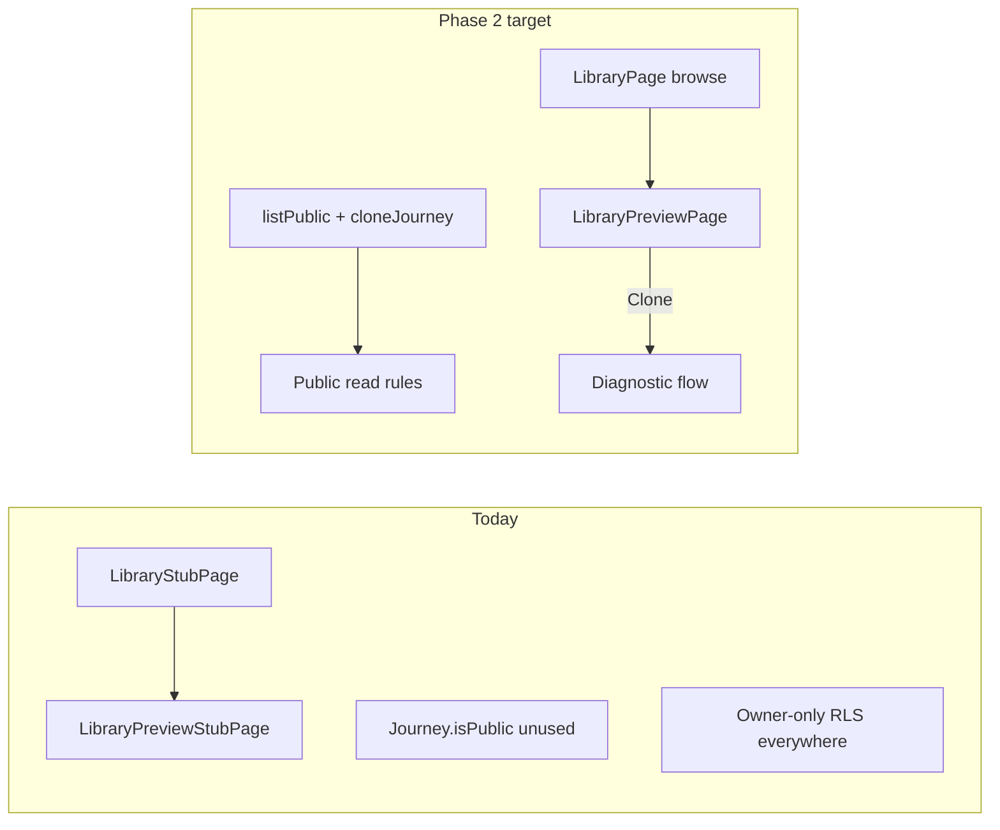
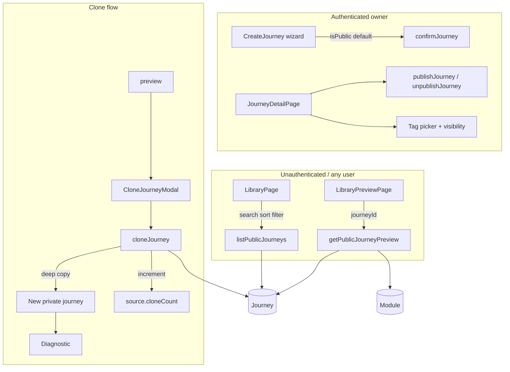
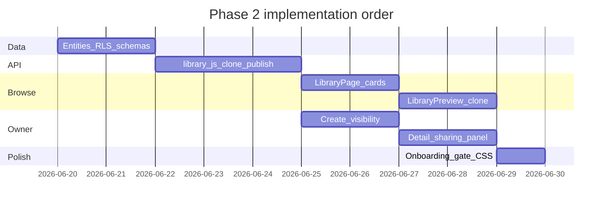

# Phase 2 — Community Library v1

**Source:** [`.cursor/plans/veridian_v1_phases_28211952.plan.md`](../.cursor/plans/veridian_v1_phases_28211952.plan.md) (Phase 2 section)  
**Depends on:** Phase 0 (auth, username, legal) and Phase 1 (study plan — no direct dependency, but clone lands users in diagnostic + weekly plan)  
**Goal:** Browse → preview → clone → study. A working community library with search, sort, visibility controls, and clone flywheel — without ratings/reviews complexity.

**Exit criteria:** A student can find a public AP Chemistry journey in `/library`, preview modules and metadata, sign up/in, clone it with their own exam date, complete diagnostic, and land on their private copy ready to study.

---

## v1 scope (locked)

| Include | Skip for v1 |
|---------|-------------|
| Public journey browse + preview | Thumbs up/down + written reviews |
| Text search (title, subject, tags) | ML relevance ranking |
| Category filter chips (AP, Pre-Med, College, Self-Learning) | Clone-count tier filters (10+/50+) |
| Sort: **Most cloned**, **Newest** | Curated/featured rows |
| Clone modal (exam date + module checklist) | Private preview links without account |
| Publish/unpublish from journey detail | Automated abuse ML |
| Visibility toggle at **create** + **journey detail** | Full Settings privacy page (Phase 3) |
| Tags (required to publish, optional at create) | User-generated tag free-for-all without curation |

### Tagging decision (recommended: **yes**)

Tags are worth shipping in Phase 2 because:

1. The master plan already requires **≥1 tag to publish** and **text search over tags**.
2. Category chips (AP, Pre-Med, etc.) map cleanly to a **curated tag vocabulary** — not a separate entity.
3. Journey detail tag editing is the natural home for **publish readiness** (quality gate + visibility).

Use a **curated picker** (`src/lib/library/libraryTags.js`) with optional subject-derived suggestions — not unbounded free text, to keep search useful and avoid abuse.

---

## Current state vs target



| Area | Today | Phase 2 |
|------|-------|---------|
| `/library` | Stub copy only | Real browse with search, filters, sort |
| `/library/:journeyId` | Stub + login prompt | Read-only preview + clone CTA |
| `isPublic` | Schema field, always `false` | Set at create + editable on detail |
| `tags` | Always `[]` | Curated tags; required to publish |
| `cloneCount` | Never incremented | +1 on successful clone |
| Clone API | None | Deep copy → new owned journey |
| RLS | Owner-only on Journey/Module/Activity | Public **read** for library-visible rows |
| Create journey | No visibility UI | Toggle + default from preferences |
| Ratings | Fields exist, unused | **Still skip** (fields remain for future) |

---

## Architecture



### Visibility model

| Concept | Field / behavior |
|---------|------------------|
| **Private** | `isPublic: false` — only owner reads/writes; hidden from library |
| **Public** | `isPublic: true` + `publishedAt` set — listed in library, previewable, clonable |
| **Default on create** | **`private`** (`isPublic: false`) — safest for minors and draft content |
| **User default** | If `UserPreferences.defaultPrivacy === 'public'`, pre-check visibility toggle on create (still editable per journey) |

**Publish** is an explicit action (or create-with-public), not silent. Unpublish sets `isPublic: false` and clears library visibility on children.

### What cloners get vs never see

| Copied on clone | Never exposed publicly |
|-----------------|------------------------|
| Title (suffix “(copy)” or user-renamed) | Owner `userEmail` |
| Subject, module names/descriptions | Sessions, cards, FSRS state |
| Module `knowledgeMap.concepts` | Personal notes in sessionData |
| Activity scaffolds (guides not generated, quizzes ready) | `sources` unless `showSources: true` |
| Journey `tags`, `priorKnowledge` default | Weekly plan snapshot |
| Fresh stages (`A`), mastery `0` | Diagnostic results from source |

---

## 1. Data model (additive only)

### Journey — [`base44/entities/Journey.jsonc`](../base44/entities/Journey.jsonc)

**Existing fields used:** `isPublic`, `tags`, `cloneCount`, `showSources`  
**Add:**

| Field | Type | Purpose |
|-------|------|---------|
| `publishedAt` | number \| null | First publish timestamp; sort “Newest” |
| `creatorUsername` | string | Denormalized from `UserPreferences.username` at publish |
| `clonedFromJourneyId` | string \| null | Lineage on cloned copies (optional display “Based on…”) |
| `libraryCategory` | string \| null | One of: `AP`, `Pre-Med`, `College`, `Self-Learning` — for filter chips (can derive from primary tag instead) |

Mirror in [`src/utils/schemas/journey.js`](../src/utils/schemas/journey.js).

**Recommendation:** Use **tags** for search + map first tag to category chip when possible; add `libraryCategory` only if chip filters need a single enum without parsing tags.

### Module & Activity — denormalized library flag

Base44 RLS cannot easily join parent Journey. On publish/unpublish, batch-update children:

| Field | Type | Purpose |
|-------|------|---------|
| `libraryVisible` | boolean | `true` when parent journey is public; drives Module/Activity **read** RLS |

Add to [`Module.jsonc`](../base44/entities/Module.jsonc) and [`Activity.jsonc`](../base44/entities/Activity.jsonc).  
Cards, Sessions, UserTelemetry remain **owner-only**.

### Zod / create flow

Extend [`createJourneySchema`](../src/utils/schemas/journey.js):

```js
isPublic: z.boolean().optional(),
tags: z.array(z.string()).max(5).optional(),
```

Extend [`journeyCreateStore`](../src/store/journeyCreateStore.js) draft:

```js
isPublic: false,
tags: [],
```

Pass through [`confirmJourney.js`](../src/api/entities/confirmJourney.js) → `createJourney`.

If `isPublic: true` at create time, run same validation as publish (min modules, tags) or force private until explicit publish — **recommended: create as private unless user toggles public AND passes publish gate on confirm step**.

---

## 2. RLS changes (Base44 publish required)

### Journey read rule

Allow read when **owner** OR **`isPublic === true`**:

```jsonc
"read": {
  "$or": [
    { "data.userEmail": "{{user.email}}" },
    { "data.isPublic": { "$eq": true } }
  ]
}
```

(Use exact Base44 dashboard syntax — verify in Security Scan after publish.)

### Module / Activity read rule

```jsonc
"read": {
  "$or": [
    { "data.userEmail": "{{user.email}}" },
    { "data.libraryVisible": { "$eq": true } }
  ]
}
```

**Write/update/delete:** remain owner-only.

### Client-side note

`checkUsernameAvailable` already documents cross-user read limits on preferences. **`creatorUsername` is denormalized on publish** so library cards never need to read another user’s preferences row.

### Onboarding gate

Exempt `/library` and `/library/:journeyId` from [`OnboardingGate`](../src/components/onboarding/OnboardingGate.jsx) so new users can browse before finishing onboarding (matches marketing CTAs on landing and empty states).

---

## 3. API layer — [`src/api/entities/library.js`](../src/api/entities/library.js) (new)

| Function | Auth | Behavior |
|----------|------|----------|
| `listPublicJourneys({ search, category, sort, limit, offset })` | Optional | `filter({ isPublic: true })` + client-side search/sort if Base44 filter limited |
| `getPublicJourneyPreview(journeyId)` | Optional | Journey + modules (names, descriptions, order) + activity types count; strip emails |
| `getPublishEligibility(journeyId)` | Owner | Returns checklist: module count, activities per module, tag count |
| `publishJourney(journeyId, { tags })` | Owner | Validate gate → set `isPublic`, `publishedAt`, `creatorUsername`, sync `libraryVisible` on children |
| `unpublishJourney(journeyId)` | Owner | `isPublic: false`, clear `libraryVisible` on children |
| `updateJourneyVisibility(journeyId, { isPublic, tags })` | Owner | Toggle without full unpublish if already published |
| `cloneJourney(sourceJourneyId, { title, examDate, moduleIds })` | Required | Deep copy → navigate to diagnostic |

Wire thin wrappers in [`journeys.js`](../src/api/entities/journeys.js) or keep library-specific file separate.

### Publish quality gate

| Rule | Threshold |
|------|-----------|
| Modules | ≥ 3 |
| Activities per module | ≥ 1 scaffolded activity (learning guide + quiz exist from scaffold) |
| Tags | ≥ 1 curated tag |
| Owner | Must be journey owner |

### Sort implementation

| Sort key | Logic |
|----------|--------|
| **Most cloned** | `cloneCount` desc, then `publishedAt` desc |
| **Newest** | `publishedAt` desc (fallback `createdAt`) |

### Search implementation (client-side v1)

After fetching public journeys (paginated batch or full list if small):

```js
function matchesSearch(journey, query) {
  const q = query.toLowerCase();
  return (
    journey.title.toLowerCase().includes(q)
    || journey.subject.toLowerCase().includes(q)
    || (journey.tags ?? []).some((t) => t.toLowerCase().includes(q))
    || (journey.creatorUsername ?? '').toLowerCase().includes(q)
  );
}
```

If public catalog grows, add Base44 function later — not v1.

### Clone algorithm — [`src/api/entities/cloneJourney.js`](../src/api/entities/cloneJourney.js)

```
1. requireAuth()
2. Load source journey (must be isPublic), modules, activities
3. Filter modules by user-selected moduleIds (default: all)
4. newJourneyId = generateJourneyId()
5. createJourney({
     ...metadata from source (title + " (copy)" or modal title),
     examDate: user-chosen,
     isPublic: false,
     tags: [...source.tags],
     clonedFromJourneyId: source.journeyId,
     cloneCount: 0,
     diagnosticSkipped: false,
   })
6. createModules — stage A, mastery 0, copy knowledgeMap
7. scaffoldJourneyActivities (same as confirmJourney)
8. Do NOT copy cards, sessions, weeklyPlanSnapshot
9. updateJourney(sourceId, { cloneCount: source.cloneCount + 1 })
10. Return { journeyId, journey } → client navigates to /journeys/:id/diagnostic
```

---

## 4. React Query

Add to [`src/api/query-keys.js`](../src/api/query-keys.js):

```js
library: {
  list: (params) => ['library', 'list', params],
  preview: (journeyId) => ['library', 'preview', journeyId],
  eligibility: (journeyId) => ['library', 'eligibility', journeyId],
},
```

| Hook | File |
|------|------|
| `usePublicJourneys(params)` | `src/hooks/queries/usePublicJourneys.js` |
| `useLibraryPreview(journeyId)` | `src/hooks/queries/useLibraryPreview.js` |
| `usePublishEligibility(journeyId)` | `src/hooks/queries/usePublishEligibility.js` |
| `useCloneJourney` | `src/hooks/mutations/useCloneJourney.js` |
| `usePublishJourney` | `src/hooks/mutations/usePublishJourney.js` |
| `useUnpublishJourney` | `src/hooks/mutations/useUnpublishJourney.js` |

Invalidate `library.list` after publish/clone; invalidate owner `journeys` after clone.

---

## 5. Frontend workstreams

### 5.1 Library browse — replace [`LibraryStubPage.jsx`](../src/pages/stubs/LibraryStubPage.jsx)

New: [`src/pages/library/LibraryPage.jsx`](../src/pages/library/LibraryPage.jsx)

| UI element | Behavior |
|------------|----------|
| Search input | Debounced filter on title/subject/tags/author |
| Category chips | AP · Pre-Med · College · Self-Learning · All |
| Sort dropdown | Most cloned · Newest |
| Grid | `LibraryJourneyCard` — title, subject, tags, clone count, author, module count |
| Empty state | No results / library empty CTA to create |
| Auth banner | Logged out: “Sign in to clone” (not blocking browse) |

### 5.2 Library preview — replace [`LibraryPreviewStubPage.jsx`](../src/pages/stubs/LibraryPreviewStubPage.jsx)

New: [`src/pages/library/LibraryPreviewPage.jsx`](../src/pages/library/LibraryPreviewPage.jsx)

| UI element | Behavior |
|------------|----------|
| Header | Title, subject, author `@username`, clone count, tags |
| Module list | Read-only names + descriptions (no study launch) |
| Activity summary | “Includes learning guides, quizzes, …” per module |
| CTA | **Clone this journey** → modal or sign-in redirect |
| Banner | Logged out: sticky “Sign up to clone” with redirect back |

### 5.3 Clone modal — [`src/components/library/CloneJourneyModal.jsx`](../src/components/library/CloneJourneyModal.jsx)

| Field | Default |
|-------|---------|
| Journey title | `{source.title} (copy)` |
| Exam date | Required (user must set their deadline) |
| Modules | Checklist, all selected by default |

On success: `navigate(/journeys/:id/diagnostic)`.

### 5.4 Journey create — visibility at first create

| File | Change |
|------|--------|
| [`StepBasicSetup.jsx`](../src/components/journey-create/StepBasicSetup.jsx) or new step | **Visibility** toggle: Private / Public (library) |
| [`StepReviewModules.jsx`](../src/components/journey-create/StepReviewModules.jsx) | Optional tag picker when public selected |
| [`journeyCreateStore.js`](../src/store/journeyCreateStore.js) | `isPublic`, `tags` in draft |
| [`confirmJourney.js`](../src/api/entities/confirmJourney.js) | Pass `isPublic`, `tags`; if public, call `publishJourney` logic after scaffold |
| [`CreateJourneyPage.jsx`](../src/pages/journeys/CreateJourneyPage.jsx) | Load `defaultPrivacy` from preferences on mount |

**UX copy for toggle:**  
“Private — only you can see this” / “Public — share to Community Library (you can change this later)”

### 5.5 Journey detail — visibility + tags + publish

New section on [`JourneyDetailPage.jsx`](../src/pages/journeys/JourneyDetailPage.jsx): [`JourneySharingPanel.jsx`](../src/components/journey-detail/JourneySharingPanel.jsx)

| Control | Behavior |
|---------|----------|
| Visibility toggle | Private ↔ Public (calls publish/unpublish with gate) |
| Tag picker | Curated multi-select; required before publish |
| Publish checklist | Modules ✓ · Activities ✓ · Tags ✓ |
| Status badge | “Public in library” / “Private” |
| Clone count | Read-only for owner when public |
| Link | “View in library” → `/library/:journeyId` when public |

Place below header or above modules list — not buried in Settings (Phase 3).

### 5.6 Components

| Component | Purpose |
|-----------|---------|
| [`LibraryJourneyCard.jsx`](../src/components/library/LibraryJourneyCard.jsx) | Card for browse grid |
| [`LibrarySearchBar.jsx`](../src/components/library/LibrarySearchBar.jsx) | Search + sort + filters |
| [`LibraryTagPicker.jsx`](../src/components/library/LibraryTagPicker.jsx) | Shared curated tag UI (create + detail) |
| [`JourneyVisibilityToggle.jsx`](../src/components/journey-detail/JourneyVisibilityToggle.jsx) | Private/public switch |

### 5.7 Routing — [`App.jsx`](../src/App.jsx)

```jsx
<Route path="/library" element={<LibraryPage />} />
<Route path="/library/:journeyId" element={<LibraryPreviewPage />} />
```

Remove stub imports. Consider moving library routes **outside** `OnboardingGate` wrapper (sibling route under `AppShell`).

### 5.8 Marketing alignment

Update links that already point to `/library`:

- [`LandingPage.jsx`](../src/pages/landing/LandingPage.jsx)
- [`HomeEmptyState.jsx`](../src/components/home/HomeEmptyState.jsx)
- [`DueTodayCaughtUp.jsx`](../src/components/home/DueTodayCaughtUp.jsx)
- [`LandingVisuals.jsx`](../src/components/landing/LandingVisuals.jsx) — roadmap: Community Library → **done**

---

## 6. Curated tags & categories — [`src/lib/library/libraryTags.js`](../src/lib/library/libraryTags.js)

```js
export const LIBRARY_CATEGORIES = [
  { id: 'AP', label: 'AP' },
  { id: 'Pre-Med', label: 'Pre-Med' },
  { id: 'College', label: 'College' },
  { id: 'Self-Learning', label: 'Self-Learning' },
];

export const LIBRARY_TAGS = [
  // AP
  'AP Chemistry', 'AP Biology', 'AP Physics', 'AP Calculus', 'AP History',
  // Pre-Med
  'MCAT', 'Organic Chemistry', 'Biochemistry', 'Anatomy',
  // College
  'Calculus', 'Statistics', 'Computer Science', 'Psychology',
  // Self-Learning
  'Language', 'Certification', 'Professional',
];
```

Category chip filters: journey matches if `tags` includes any tag mapped to category OR `libraryCategory` matches.

---

## 7. CSS — [`src/css/app.css`](../src/css/app.css)

- `.library-page`, `.library-toolbar`, `.library-grid`
- `.library-journey-card`, `.library-card-meta`, `.library-tag`
- `.library-preview-page`, `.library-preview-modules`
- `.clone-journey-modal`
- `.journey-sharing-panel`, `.publish-checklist`, `.visibility-badge`

Match existing dark theme and `detail-section-box` patterns.

---

## 8. Hard constraints (do not violate)

| Do NOT change | Exception |
|---------------|-----------|
| Study planner / FSRS / AI generation | — |
| Phase 1 weekly plan engine | Clone resets plan on new journey |
| Ratings UI | Fields stay on entity, unused |
| Session / Card public exposure | Owner-only always |
| Routing beyond `/library` paths | Add preview + update App.jsx only |

---

## 9. Implementation order



1. Entity fields + Zod + `libraryTags.js`
2. RLS rules (Journey public read; Module/Activity `libraryVisible`)
3. `library.js` + `cloneJourney.js` APIs
4. React Query hooks + mutations
5. `LibraryPage` + `LibraryJourneyCard` + search/sort/filter
6. `LibraryPreviewPage` + `CloneJourneyModal`
7. Create flow visibility + tags
8. `JourneySharingPanel` on detail
9. Onboarding gate exemption + route swap
10. CSS + marketing roadmap updates
11. Manual test pass + Base44 publish

---

## 10. Manual test plan

| # | Flow | Expected |
|---|------|----------|
| 1 | Visit `/library` logged out | Browse loads public journeys; search/sort work |
| 2 | Open `/library/:id` logged out | Preview shows modules; clone prompts sign-in |
| 3 | Sign in → clone | Modal → exam date → diagnostic on **new** journey |
| 4 | Source `cloneCount` | Increments by 1 |
| 5 | Create journey private (default) | Not in library |
| 6 | Create journey public + tags | Appears in library after publish gate passes |
| 7 | Toggle private on detail | Removed from library list |
| 8 | Publish without 3 modules | Blocked with checklist message |
| 9 | Publish without tags | Blocked |
| 10 | Clone copy | No source cards/sessions; fresh modules stage A |
| 11 | `defaultPrivacy: public` pref | Create wizard toggle pre-checked |

---

## 11. Base44 publish checklist

- [ ] Publish entity changes (Journey, Module, Activity fields)
- [ ] Apply RLS read rules; run Security Scan
- [ ] Publish site
- [ ] Seed 1–2 public test journeys for QA
- [ ] Verify anonymous read on `/library` in production

---

## 12. Phase 2 completion checklist

- [ ] `listPublicJourneys` + browse UI with search, category chips, sort
- [ ] Preview page with module list and clone CTA
- [ ] `cloneJourney` deep copy + diagnostic redirect + `cloneCount`
- [ ] Visibility toggle on create (default **private**, respects `defaultPrivacy`)
- [ ] Journey detail sharing panel (visibility, tags, publish gate)
- [ ] RLS allows public read for library content only
- [ ] Tags curated picker; ≥1 required to publish
- [ ] `/library` exempt from onboarding gate
- [ ] Stubs removed; landing roadmap updated
- [ ] No ratings/reviews UI shipped

---

## 13. Build todo list (for agent execution)

Copy into Cursor todos when starting implementation:

| ID | Task | Depends |
|----|------|---------|
| p2-schemas | Add Journey fields (`publishedAt`, `creatorUsername`, `clonedFromJourneyId`), Module/Activity `libraryVisible`; Zod + `libraryTags.js` | — |
| p2-rls | Document and apply Base44 RLS public read rules; `syncLibraryVisibility` helper | p2-schemas |
| p2-api-list-preview | `listPublicJourneys`, `getPublicJourneyPreview`, search/sort helpers | p2-rls |
| p2-api-publish | `publishJourney`, `unpublishJourney`, `getPublishEligibility` | p2-rls |
| p2-api-clone | `cloneJourney` deep copy + `cloneCount` increment | p2-api-list-preview |
| p2-hooks | Query keys + hooks/mutations for library | p2-api-clone |
| p2-library-page | `LibraryPage`, `LibraryJourneyCard`, `LibrarySearchBar` | p2-hooks |
| p2-preview-clone | `LibraryPreviewPage`, `CloneJourneyModal` | p2-hooks |
| p2-create-visibility | Create wizard toggle + tags + `confirmJourney` wiring + `defaultPrivacy` | p2-api-publish |
| p2-detail-sharing | `JourneySharingPanel` on journey detail | p2-api-publish |
| p2-routing-gate | App routes, remove stubs, onboarding gate exemption | p2-library-page |
| p2-css-marketing | CSS + landing/empty-state roadmap updates | p2-routing-gate |
| p2-test-publish | Manual test plan + Base44 publish | all |

---

## 14. Open questions (defaults chosen)

| Question | Decision for v1 |
|----------|-----------------|
| Default visibility | **Private**; honor `defaultPrivacy` pref as pre-checked toggle |
| Tags at create vs publish only | Optional at create; **required at publish** |
| Anonymous browse | **Yes** — read-only library and preview |
| Ratings | **Defer** — schema fields only |
| Server function vs client RLS | **Client RLS + denormalized `libraryVisible`** first; function if Base44 scan blocks OR rules |

---

## Files summary

**New:** `src/api/entities/library.js`, `src/api/entities/cloneJourney.js`, `src/lib/library/libraryTags.js`, `src/pages/library/LibraryPage.jsx`, `src/pages/library/LibraryPreviewPage.jsx`, `src/components/library/*`, `src/components/journey-detail/JourneySharingPanel.jsx`, `src/hooks/queries/usePublicJourneys.js`, `src/hooks/queries/useLibraryPreview.js`, `src/hooks/mutations/useCloneJourney.js`, `src/hooks/mutations/usePublishJourney.js`

**Modify:** `base44/entities/Journey.jsonc`, `Module.jsonc`, `Activity.jsonc`, `src/utils/schemas/journey.js`, `src/api/entities/journeys.js`, `src/api/entities/confirmJourney.js`, `src/store/journeyCreateStore.js`, `src/components/journey-create/*`, `src/pages/journeys/JourneyDetailPage.jsx`, `src/App.jsx`, `src/components/onboarding/OnboardingGate.jsx`, `src/api/query-keys.js`, `src/css/app.css`

**Delete/replace:** `src/pages/stubs/LibraryStubPage.jsx`, `src/pages/stubs/LibraryPreviewStubPage.jsx` (after real pages wired)
